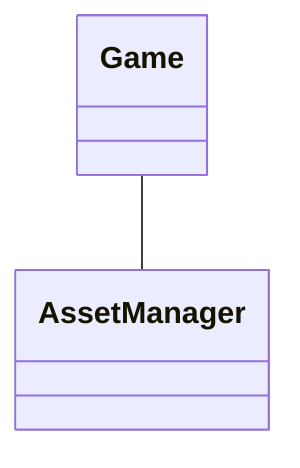

# PCGLab

## Introduction
PCGLab is a procedural content generation environment made in JavaScript. It is designed to be an study lab for easy to use and to be extensible procedural content methods.

## Architecture

The project is divided in two main parts: the core and the modules. The core is responsible for the main functionalities of the project, such as the user interface, the game loop and the rendering. The modules are responsible for the procedural content generation methods. The core and the modules are connected by the `core` object, which is passed as a parameter to the modules.



```

## Modules


